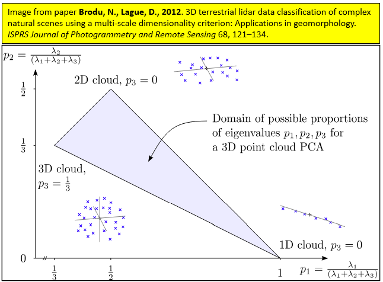

# CloudGeometry

<!-- badges: start -->

[](https://github.com/fpirotti/CloudGeometry/actions/workflows/R-CMD-check.yaml)

<!-- badges: end -->

The goal of CloudGeometry is to compute geometric features for each point in a point cloud.

Geometric features catch geometrical patterns around a certain position in 3D space based on information available from the neighboring points (local neighborhood).

Geometrical patterns can be described using the eigenvalues of the 3D structure tensor represented by the 3D covariance matrix derived from the 3D coordinates of all points within the local neighborhood [Weinmann et al. 2015](#1).



Eigenvalues repartitions for the local neighborhood PCA. Source [Brodu&Lague 2012](#2)

------------------------------------------------------------------------

Due to the the expected large volume of points in point clouds that are surveyed with laser scanners or created by photogrammetric procedures, this package uses a fast implementation using [Armadillo C++ library for linear algebra & scientific computing](https://arma.sourceforge.net/) to implement an optimized kdtree structure and implicit nearest neighbour search-by-radius. OpenMP is used for parallelization, leading to 4x to 100x increased speed depending on the number of available threads.

Geometric features are used to describe a point neighbourhood and are widely used to increase the number of features that describe the 3D scene . This can be used as descriptors in training machine learning models for segmentation and classification.

The following geometric features are currently implemented:

-   1st eigenvalue
-   2nd eigenvalue
-   3rd eigenvalue
-   Planarity
-   Linearity
-   Sphericity
-   Verticality
-   Sum of eigenvalues
-   Omnivariance
-   Eigenentropy
-   Anisotropy
-   PCA 1
-   PCA 2
-   Surface variation

## Installation

You can install the development version of CloudGeometry from [GitHub](https://github.com/) with:

``` r
# install.packages("devtools")
devtools::install_github("fpirotti/CloudGeometry")
```

## Example

This is a basic example which shows you how to process a lidar point cloud:

``` r

## basic example code

library(CloudGeometry)
gf <- calcGF(lidar, 2, TRUE)
```


## Future developments

More feature descriptors such as Fast Point Feature Histograms (FPFH) as implemented in [point cloud library](https://pcl.readthedocs.io/) will be coming up.

## References

<a id="1">[1]</a> Weinmann, M., Jutzi, B., Hinz, S., Mallet, C., 2015. Semantic point cloud interpretation based on optimal neighborhoods, relevant features and efficient classifiers. ISPRS J. Photogramm. Remote Sens. 105, 286–304. <https://doi.org/10.1016/j.isprsjprs.2015.01.016>

<a id="2">[2]</a> Brodu, N., Lague, D., 2012. 3D terrestrial lidar data classification of complex natural scenes using a multi-scale dimensionality criterion: Applications in geomorphology. ISPRS Journal of Photogrammetry and Remote Sensing 68, 121–134. <https://doi.org/10.1016/j.isprsjprs.2012.01.006>
